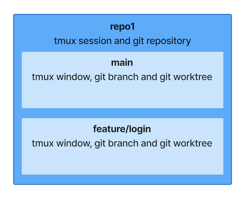

<div align="center">

# 🥢 hashi (箸)

**One branch, one worktree, one tmux window — managed together**

[](https://github.com/wasabi0522/hashi/actions/workflows/ci.yaml)
[](LICENSE)


</div>

hashi enforces a simple mapping between git and tmux so there is nothing to remember:

```
1 git repo   = 1 tmux session
1 git branch = 1 git worktree = 1 tmux window
```



## Why hashi?

In a tmux + git workflow, you manage tmux sessions/windows and git branches/worktrees independently.
Over time, this leads to a familiar problem:

- "Which tmux window had that branch open?"
- "Did I already create a worktree for this branch?"
- "Is this window still pointing to a valid worktree?"

You spend time **searching, remembering, and reconciling** instead of coding.

hashi solves this with a single command per action:

| Without hashi                                  | With hashi                                              |
| ---------------------------------------------- | ------------------------------------------------------- |
| Searching for which window has your branch     | Branch name = window name, always                       |
| Manually keeping worktrees and windows in sync | `hashi new` / `remove` manage them atomically           |
| Orphaned windows or missing worktrees          | `hashi list` detects drift, `hashi switch` auto-repairs |

## Installation

> [!NOTE]
> Requires **git 2.31+** and **tmux**.

```bash
brew install wasabi0522/tap/hashi
```

<details>
<summary>Other installation methods</summary>

**Go install:**

```bash
go install github.com/wasabi0522/hashi@latest
```

**GitHub Releases:**

Download a binary from [Releases](https://github.com/wasabi0522/hashi/releases) and place it somewhere in your `PATH`.

</details>

## Quick Start

Run these commands inside a git repository. If you are already in tmux, hashi works in your current session. Otherwise, it creates a new session and attaches to it.

Create a branch — its directory and tmux window appear automatically:

```bash
hashi new feature/login
```

Start a second branch:

```bash
hashi new fix/typo
```

Switch back — your tmux window jumps to feature/login:

```bash
hashi switch feature/login
```

See everything at a glance (`*` marks the active window):

```bash
hashi list
```

```
   BRANCH          WORKTREE                                    STATUS
 * feature/login   /home/user/repo/.worktrees/feature/login
   fix/typo        /home/user/repo/.worktrees/fix/typo
   main            /home/user/repo
```

Done with a branch? Remove everything together:

```bash
hashi remove fix/typo
```

```
Remove 'fix/typo'? (branch, worktree, window) y/N [N] y
Removed 'fix/typo'
```

## Commands

| Command                         | Alias      | Description                                       |
| ------------------------------- | ---------- | ------------------------------------------------- |
| `hashi new <branch> [base]`     | `n`        | Create a branch with its worktree and tmux window |
| `hashi switch <branch>`         | `sw`       | Switch to an existing branch and its tmux window  |
| `hashi list [--json]`           | `ls`       | List all managed branches, worktrees, and windows |
| `hashi rename <old> <new>`      | `mv`       | Rename a branch, worktree, and window together    |
| `hashi remove [-f] <branch...>` | `rm`       | Remove branches, worktrees, and windows together  |
| `hashi init`                    |            | Generate a `.hashi.yaml` config template          |
| `hashi completion <shell>`      |            | Output shell completion script (bash/zsh/fish)    |

hashi manages local resources only — it never runs `git push`, `git pull`, or modifies remote branches.

## How It Works

### Worktree layout

Each branch gets its own directory under `.worktrees/` in the repository root:

```
~/repo/
├── .worktrees/
│   ├── feature/login/      ← hashi new feature/login
│   └── fix/typo/           ← hashi new fix/typo
├── .git/
├── src/
└── ...
```

The main branch uses the original clone directory — it is never duplicated under `.worktrees/`.

### What happens when things get out of sync?

If resources get out of sync (e.g. a tmux window was closed manually), `hashi list` shows what went wrong and how to fix it:

```
   BRANCH          WORKTREE              STATUS
   feature/login   (worktree missing)    ⚠ Run 'hashi new feature/login'
   orphan-x        (orphaned window)     ⚠ Run 'hashi remove orphan-x'
```

`hashi switch` and `hashi new` automatically repair missing resources — if a window exists without a worktree (or vice versa), the missing piece is created.

<details>
<summary>Session naming, rollback, and tmux behavior</summary>

#### Session and window naming

hashi derives the tmux session name from the git remote URL with an `hs/` prefix. Window names carry the same prefix:

```
git@github.com:user/repo.git  →  tmux session: hs/user/repo
                                  tmux window:  hs/feature/login
```

If no remote is configured, the directory name is used instead (e.g. `hs/my-project`).

Special characters in the name are sanitized: `:` and whitespace become `-`, leading dots are removed.

Your tmux status bar becomes a branch list.

#### Rollback on failure

`hashi new` performs multiple steps (create branch, create worktree, create tmux window). If a step fails partway through, hashi rolls back already-created resources on a best-effort basis.

#### Works inside and outside tmux

- **Inside tmux**: `hashi new` / `hashi switch` use `switch-client` to jump to the target window.
- **Outside tmux**: hashi creates the session if needed and attaches to it.

</details>

## Configuration

No config file is needed — defaults work out of the box. To customize, place a `.hashi.yaml` at the repository root.

For example, `hooks.post_new` can run setup commands (like `npm install`) in each new worktree, and `copy_files` can copy files (like `.env`) from the main tree:

```yaml
# Change worktree directory (default: .worktrees)
worktree_dir: .wt

hooks:
  # Copy files/directories into each new worktree
  copy_files:
    - .env.local
    - .vscode

  # Commands to run after creating a worktree
  post_new:
    - npm install
```

Environment variables (`HASHI_` prefix) override the config file. For example, `HASHI_WORKTREE_DIR=.wt` overrides `worktree_dir`.

Run `hashi init` to generate a commented-out template. See also the [`.hashi.yaml`](.hashi.yaml) in this repository for a real-world example.

## License

[MIT](LICENSE)
